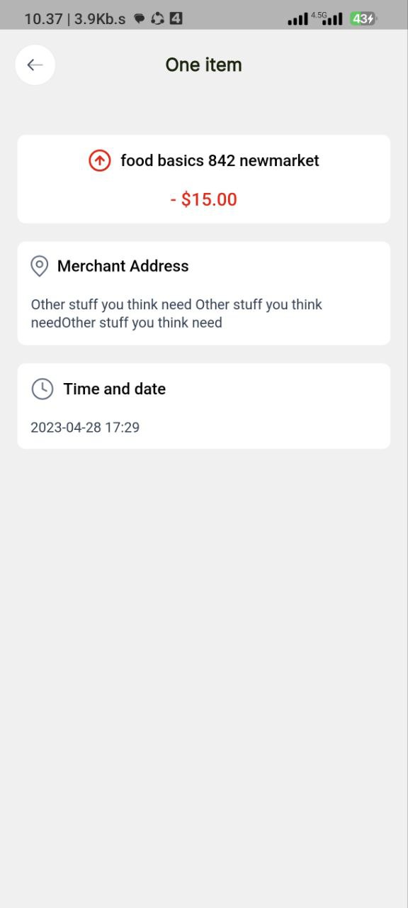
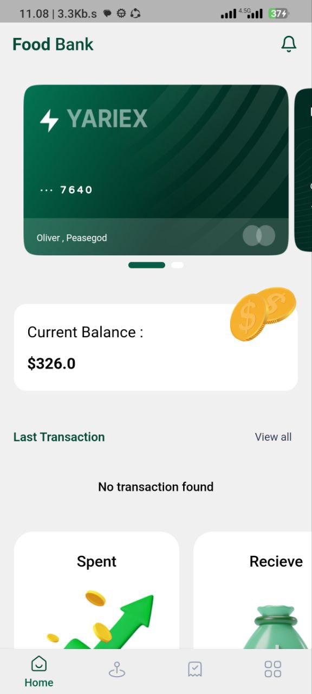
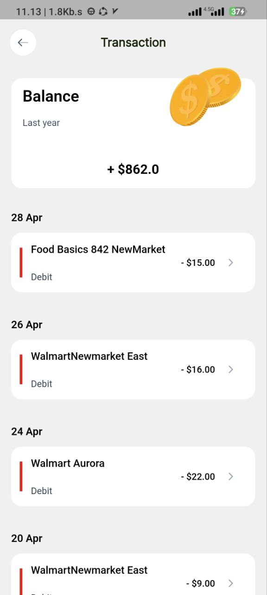
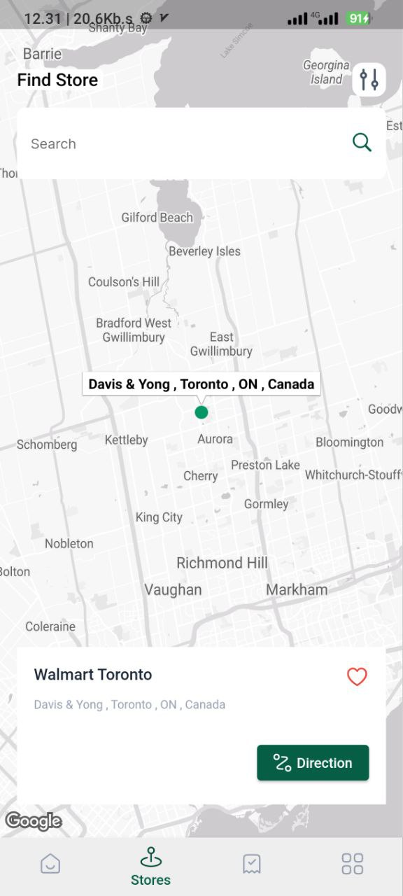
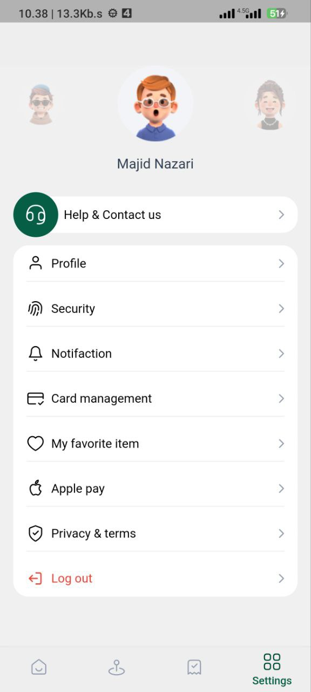

<div align="center">


<br/>


</div>

---

## 📱 App Overview

**Yariex** is a feature-rich Flutter application with a modern and clean UI, built following Clean Architecture principles and powered by Firebase on the backend.

---

## 🖼️ Screenshots

<div align="center">

| Screen 1 | Screen 2 | Screen 3 |
|----------|----------|----------|
|  |  |  |

| Screen 4 | Screen 5 |
|----------|----------|
|  |  |

</div>

---

## ✨ Key Features

- 🎨 **Modern UI/UX** — Pixel-perfect design with smooth animations
- 🔐 **Authentication** — Firebase Auth integration
- 🔄 **Real-time Data** — Firestore live synchronization
- 📦 **Clean Architecture** — Scalable and maintainable codebase
- 📱 **Responsive Design** — Adapts to all screen sizes
- ⚡ **Performance** — Optimized for 60fps rendering

---

## 🏗️ Architecture & Tech Stack

```
lib/
├── core/              # Utilities, theme, constants
├── features/          # Feature modules (Clean Arch)
│   ├── data/          # Repositories, data sources
│   ├── domain/        # Entities, use cases
│   └── presentation/  # BLoC, screens, widgets
└── shared/            # Reusable components
```

| Layer | Technology |
|-------|-----------|
| **UI** | Flutter + Custom Widgets |
| **State** | BLoC / Cubit |
| **Architecture** | Clean Architecture |
| **Backend** | Firebase (Firestore, Auth, Storage) |
| **DI** | GetIt |

---

## 🚀 Platforms


---

<div align="center">

> 🔒 *Source code is private. For collaboration or inquiries, contact below.*

[](https://github.com/AchkanDev)


</div>
